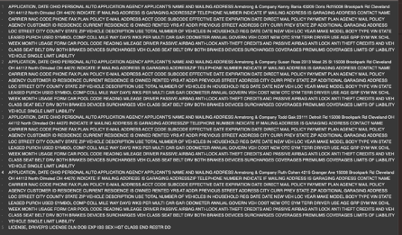
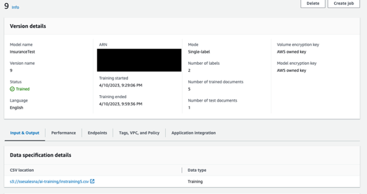
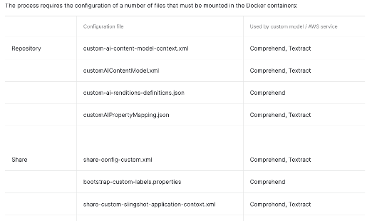
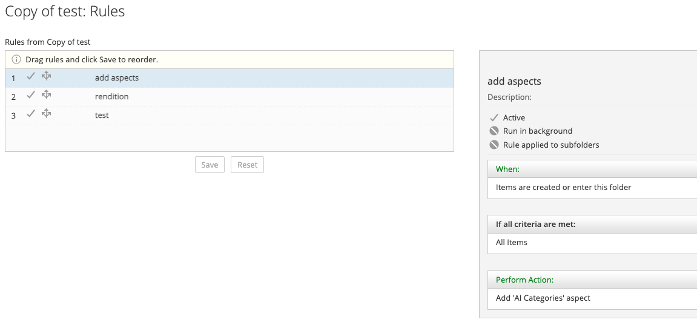
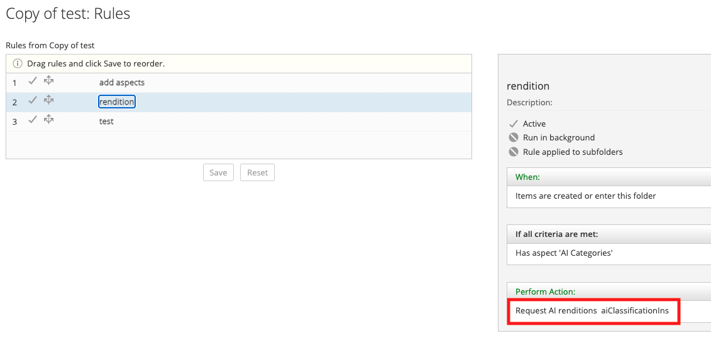
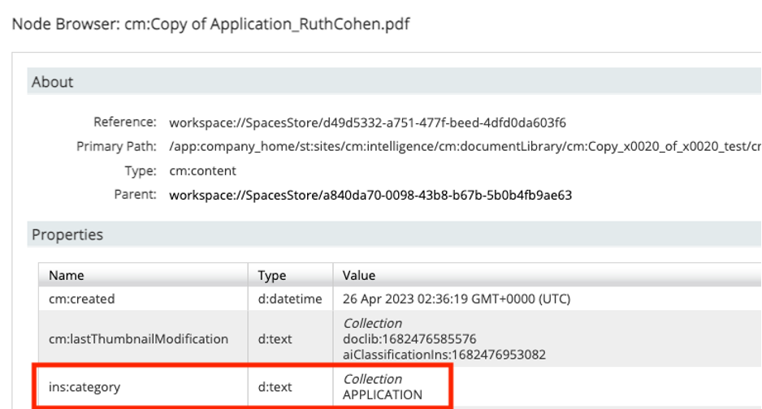
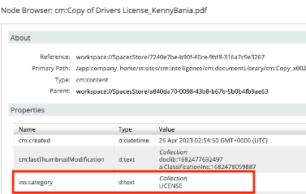

#### This article details the steps required to configure Alfresco Intelligence Service (AIS) to utilize comprehend services for classification and metadata extraction 

### Use-Case / Requirement
The Alfresco system should perform AIS operations inorder to Classify content and assign metadata from the document based on the classification type.

### How It Works
Alfresco Intelligence Service leverages Amazon Comprehend uses a pre-trained model to examine and analyze a document or set of documents to gather insights about it.  In this example we are exploring the classification functionality presented through Comprehend.

###Documentation
1. https://docs.alfresco.com/intelligence-services/latest/config/
2. https://docs.alfresco.com/intelligence-services/latest/config/comprehend/
3. https://docs.alfresco.com/intelligence-services/latest/config/textract/
4. https://docs.alfresco.com/intelligence-services/latest/using/
5. https://docs.aws.amazon.com/comprehend/latest/dg/how-document-classification.html
6. https://docs.aws.amazon.com/comprehend/latest/dg/prep-classifier-data.html

##Configuration
1. Install/Deploy `Alfresco Intelligence Services`
> Note: ADP Users should deploy AIS using `./adp.py deploy ai` followed by STOP and START of all containers.

2. Train Custom Classification Model

 
 

4. Create and deploy/mount the appropriate configuration files required based on the service used for interaction shown below :

4.Configure Folder Rules to:
    1. Add Aspects. 
    
    2. Perform AI Renditions (AWS Comprehend). 
    

### ACS : Results
The resulting view : 
Appying custom aspect with classification identified.

