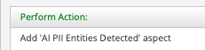
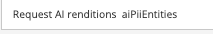
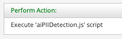

#### This article details the steps required to configure Alfresco Intelligence Service (AIS) to perform PII Detection use cases to update Security Classification in ACS

### Use-Case / Requirement
The Alfresco system should perform NLP Extraction on ingested documents and the detected entities in your text that contain personally identifiable information (PII), or PII entities should be available as metadata of the ingested document.

### How It Works
Alfresco Intelligence Service leverages AWS Comprehend which uses Natural Language Processing (NLP) to extract insights about content.  

###Documentation
1. https://docs.alfresco.com/intelligence-services/latest/
2. https://docs.alfresco.com/intelligence-services/latest/admin/
3. https://docs.aws.amazon.com/comprehend/latest/dg/what-is.html
4. https://docs.aws.amazon.com/comprehend/latest/dg/how-pii.html


##Configuration
1. Install/Deploy `Alfresco Intelligence Services`.
> Note: ADP Users should deploy AIS using `./adp.py deploy ai` followed by STOP and START of all containers.

2. Develop the Javascript for OCR extraction and updating the metadata.  Full Script found at [piiDetection.js](artifacts/piiDetection.js)

<details>
		<summary>Expand this section for the sample javascript.</summary>
		
```javascript
	if(schemas[t][key].type == "SSN")
	{
		logger.log(schemas[t][key].type + " Identified ");
		logger.log("parent id: " + document.getParent().id);
										
		var requestBody = '{"id": "zMKc15jZ","groupId": "5643299b-8f8c-4f47-8f62-7cd51cac6766","op": "ADD"}';										

		logger.log(requestBody);
										
																											
		http.post('http://ec2-54-89-143-94.compute-1.amazonaws.com/alfresco/api/-default-/public/gs/versions/1/secured-nodes/' + document.getParent().id + '/securing-marks', requestBody, "application/json;charset=UTF-8", "demo", "demo");
		logger.error(r);									
	}
```


```javascript
	if(schemas[t][key].type == "BANK_ROUTING")
		{
			logger.log(schemas[t][key].type + " Identified ");
			logger.log("parent id: " + document.getParent().id);
										

			var requestBody = '{"id": "zMKc15jZ","groupId": "5643299b-8f8c-4f47-8f62-7cd51cac6766","op": "ADD"}';												
			logger.log(requestBody);
																																		
			http.post('http://ec2-54-89-143-94.compute-1.amazonaws.com/alfresco/api/-default-/public/gs/versions/1/secured-nodes/' + document.getParent().id + '/securing-marks', requestBody, "application/json;charset=UTF-8", "demo", "demo");
			
			logger.error(r);									

		}
```									
</details>

<br/>
3. Save and update the description of the javascript

4.  Configure Folder Rules to:
    1. Add Aspects.
    
    2. Perform AI Renditions (AWS Textract).
    
    3. Execute javascript to update metadata.
    


### ACS : Results
Upload a [sample-invoice-document](artifacts/Invoice-Investment.pdf). <br/>
The resulting view :
