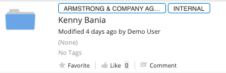

#### This article details the steps required to configure Alfresco Intelligence Service (AIS) to perform AWS Comprehend text analysis detecting personally identifiable information (PII) in English text documents  within ACS.  Useful when looking automate additional security processing based on PII identified.    

### Use-Case / Requirement
The Alfresco system should perform textual analysis on ingested documents.  Comprehend uses natural language processing (NLP) to extract insights about the content of documents. It develops insights by recognizing the entities, key phrases, language, sentiments, and other common elements in a document.  Using AIS this data is available as metadata associated with the ingested document.  This metadata can be used to deliver timely and actionable alerts or processing when Personally Identifiable Information is detected. Use the detection and analysis in evaluating to remotely verify the identity of a user.  The list of use cases could go on.

### How It Works
Alfresco Intelligence Service leverages Amazon Comprehend uses a pre-trained model to examine and analyze a document or set of documents to gather insights about it.

###Documentation
1. https://docs.alfresco.com/intelligence-services/latest/
2. https://docs.alfresco.com/intelligence-services/latest/admin/
3. https://docs.aws.amazon.com/comprehend/latest/dg/what-is.html
4. https://docs.aws.amazon.com/comprehend/latest/dg/how-pii.html


##Configuration
1. Install/Deploy `Alfresco Intelligence Services`
> Note: ADP Users should deploy AIS using `./adp.py deploy ai` followed by STOP and START of all containers.

2. Install/Deploy `Alfresco Governance Services`
> Note: ADP Users should deploy AIS using `./adp.py deploy ags` followed by STOP and START of all containers.

3. Create Security Marks in Administration console

4. Create Classification Guide in the administration console

5. Use Governance Security Marks API to find the Group ID and Security Mark ID <br/>
[GroupID API](artifacts/Groupid.png) <br/>
[Security Mark API](artifacts/secmark.png) <br/>

6. Develop the Javascript for PII extraction and updating the metadata.

## Javascript Examples that Utilize Secured Nodes API
```javascript									
if(schemas[t][key].type == "SSN")
{
	logger.log(schemas[t][key].type + " Identified ");
	logger.log("parent id: " + document.getParent().id);
										
	var requestBody = '{"id": "zMKc15jZ","groupId": "5643299b-8f8c-4f47-8f62-7cd51cac6766","op": "ADD"}';										

	logger.log(requestBody);
																																				
	http.post('{HostName}/alfresco/api/-default-/public/gs/versions/1/secured-nodes/' + document.getParent().id + '/securing-marks', requestBody, "application/json;charset=UTF-8", "uname", "pw");
	logger.error(r);									
}
```
```javascript
if(schemas[t][key].type == "BANK_ROUTING")
{
	logger.log(schemas[t][key].type + " Identified ");
	logger.log("parent id: " + document.getParent().id);
										
	var requestBody = '{"id": "zMKc15jZ","groupId": "5643299b-8f8c-4f47-8f62-7cd51cac6766","op": "ADD"}';												
	logger.log(requestBody);					
																											
	http.post('{HostName}/alfresco/api/-default-/public/gs/versions/1/secured-nodes/' + document.getParent().id + '/securing-marks', requestBody, "application/json;charset=UTF-8", "uname", "pw");
	logger.error(r);									

}	
```	
<br/>

7. Save and update the description of the javascript

8.  Configure Folder Rules to:
    1. Add Aspects.<br/>
    
    2. Perform AI Renditions (AWS Comprehend).<br/>
    
    3. Execute javascript to update metadata.<br/>
    


### ACS : Results
The resulting view :<br/>
Appying Security Marks at the folder level securing the entire record/object and not just the document itself.
