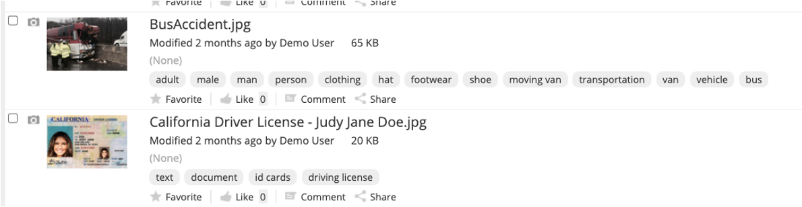

#### This article details the steps required to configure Alfresco Intelligence Service (AIS) to perform Rekognition for objects, people, text, scenes, and activities identificaton to auto label content within ACS.  Useful when looking to drive additional processing based on subjects identified.    

### Use-Case / Requirement
The Alfresco system should perform powerful visual analysis on ingested documents.  Using Rekognition objects, scenes, activities, landmarks, faces, dominant colors, and image quality should be available as metadata of the ingested document.  This metadata can be used to deliver timely and actionable alerts when a desired object is detected. Use facial comparison and analysis in your user onboarding and authentication workflows to remotely verify the identity of a user.  The list of use cases could go on.

### How It Works
Alfresco Intelligence Service leverages AWS Rekognition which uses ML, once trained, to extract iand identify objects and scenes in images that are specific to your business needs.

###Documentation
1. https://docs.alfresco.com/intelligence-services/latest/
2. https://docs.alfresco.com/intelligence-services/latest/admin/
3. https://docs.aws.amazon.com/rekognition/latest/dg/what-is.html

##Configuration
1. Install/Deploy `Alfresco Intelligence Services`.
> Note: ADP Users should deploy AIS using `./adp.py deploy ai` followed by STOP and START of all containers.

2. Develop the Javascript for Applying Tags Via AIS  -> [AI_Rekogniton_ApplyTags.js](artifacts/aiRekognition.js)

3. Update ACS folder rules to run script for desired criteria
	1. Add Aspects 
	2. Perform AI Renditions(AWS Rekognition) 
	3. Execute javascript to update Nodes with tags 

### ACS : Results
The resulting view :
Applying Tags at the Node level 
