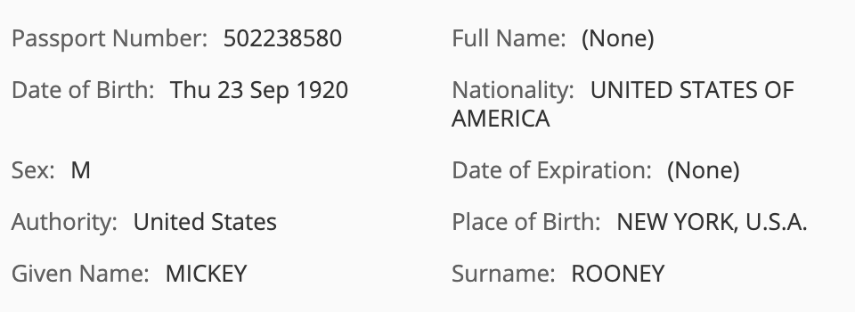

#### This article details the steps required to configure Alfresco Intelligence Service (AIS) to utilize comprehend services for classification and metadata extraction 

### Use-Case / Requirement
The Alfresco system should perform AIS operations inorder to Classify content and assign metadata from the document based on the classification type.

### How It Works
Alfresco Intelligence Service leverages Amazon Textract to extract printed text, handwriting and data from any document.

###Documentation
1. https://docs.alfresco.com/intelligence-services/latest/config/
2. https://docs.alfresco.com/intelligence-services/latest/config/textract/
3. https://docs.alfresco.com/intelligence-services/latest/using/
4. https://docs.aws.amazon.com/textract/latest/dg/what-is.html
5. https://docs.aws.amazon.com/textract/latest/dg/how-it-works-detecting.html
6. https://docs.aws.amazon.com/textract/latest/dg/how-it-works-analyzing.html
7. https://docs.aws.amazon.com/textract/latest/dg/sync-calling.html#sync-response

##Configuration
1. Install/Deploy `Alfresco Intelligence Services`
> Note: ADP Users should deploy AIS using `./adp.py deploy ai` followed by STOP and START of all containers.

2. Create Appropriate Content Model for Textract Usage

3. Create Javascript Code for Textract and updating the metadata -> [AI_Textract_Passport.js](artifacts/aiTextract_Passport.js)

4. Update ACS folder rules to run script for desired criteria
	1. Add Aspects 
	2. Perform AI Renditions(AWS Textract) 
	3. Execute javascript to update Nodes with metadata 

### ACS : Results
The resulting view : 
Appying metadat to specified Passport Type.

